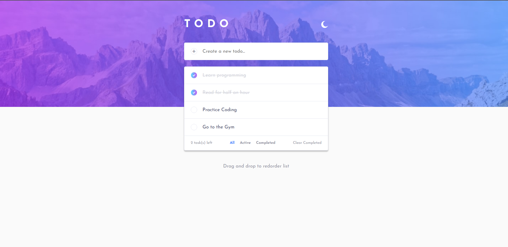
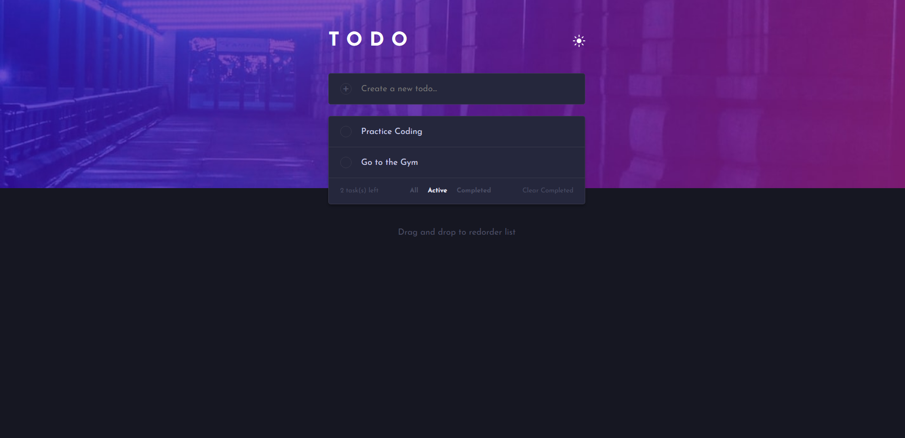
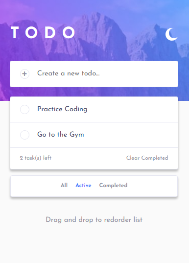
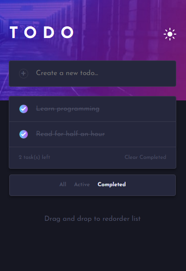

# Frontend Mentor - Todo App Solution

This is my solution to the [Frontend Mentor Todo App Challenge](https://www.frontendmentor.io/challenges/todo-app-Su1_KokOW). The project focuses on building a fully interactive todo application with filtering, theme switching, local storage persistence, and drag-and-drop functionality.

## Overview

### Features

Users can:

- Add new tasks
- Mark tasks as completed
- Delete tasks
- Filter tasks by:
  - All
  - Active
  - Completed
- Clear all completed tasks
- Toggle between Light and Dark themes
- Reorder tasks using Drag & Drop
- Persist data using Local Storage
- Navigate key interactions using the keyboard

---

## Screenshots

| Desktop Light | Desktop Dark |
|---------------|--------------|
|  |  |

| Mobile Light | Mobile Dark |
|--------------|-------------|
|  |  |

---

## Links

- **Live Site:** https://mohamad-aboeisa.github.io/Todo-App/
- **Frontend Mentor Solution:** [Solution](https://www.frontendmentor.io/solutions/todo-app-using-html5-css3-scss-javascript-es6-modules-iw1wyERJzv) 
- **Repository:** https://github.com/mohamad-aboeisa/Todo-App

---

## Built With

- HTML5
- CSS3
- SCSS
- JavaScript (ES6 Modules)
- Local Storage API
- Vite
- CSS Custom Properties
- Flexbox
- CSS Grid
- Drag and Drop API

---

## Project Highlights

### Theme Switching

Implemented a Light/Dark theme system using CSS Custom Properties and JavaScript. User preferences are saved in Local Storage and restored on page reload.

### Task Filtering

Built task filtering functionality using radio buttons and labels while maintaining keyboard accessibility support.

### Local Storage Persistence

All tasks, task states, theme preferences, and task order are stored locally, ensuring data remains available between sessions.

### Drag & Drop Reordering

Implemented drag-and-drop functionality allowing users to reorder tasks. The new order is saved and restored automatically.

### Accessibility

Special attention was given to keyboard navigation and interactive elements to improve usability and accessibility.

---

## What I Learned

This project helped me gain practical experience with:

- Managing application state using JavaScript
- Working with Local Storage
- Creating reusable utility functions
- Implementing filtering logic
- Handling drag-and-drop interactions
- Improving keyboard accessibility
- Organizing a project using ES Modules
- Working with Vite for development and deployment

One of the most challenging and rewarding parts of the project was implementing the drag-and-drop functionality while maintaining correct task ordering and data persistence.

---

## Code Highlights

### Drag and Drop Reordering

```js
let draggedId = null;

export const handleDragStart = (e) => {
  draggedId = e.currentTarget.dataset.id;
};

export const handleDragOver = (e) => {
  e.preventDefault();
};

export const handleDrop = (e) => {
  e.preventDefault();

  const targetId = e.currentTarget.dataset.id;

  if (draggedId === targetId) return;

  const tasks = fetchData("tasks");

  const draggedIndex = tasks.findIndex(
    (task) => task.id === draggedId
  );

  const targetIndex = tasks.findIndex(
    (task) => task.id === targetId
  );

  const [draggedTask] = tasks.splice(draggedIndex, 1);

  tasks.splice(targetIndex, 0, draggedTask);

  saveToDB("tasks", tasks);

  initTaskList();
};
```

### Theme Management

```css
.container.darkTheme {
  --primary-text-color: var(--Purple300);
  --secondary-text-color: var(--Purple700);
  --primary-bg-color: var(--Navy950);
  --secondry-bg-color: var(--Navy900);
  --bg-image: var(--bg-desktop-dark);
  --border-color: var(--Purple800);
}
```

---

## AI Collaboration

During development, I used ChatGPT as a learning and debugging tool. It helped me better understand the logic behind:

- Task filtering
- Drag-and-drop implementation
- State management
- Accessibility improvements
- JavaScript best practices

The goal was not simply to generate code, but to understand the underlying concepts and improve my problem-solving approach.

---

## Author

- GitHub: https://github.com/mohamad-aboeisa
- LinkedIn: https://www.linkedin.com/in/mohamad-osama-aboeisa/
- Frontend Mentor: https://www.frontendmentor.io/profile/mohamad-aboeisa
